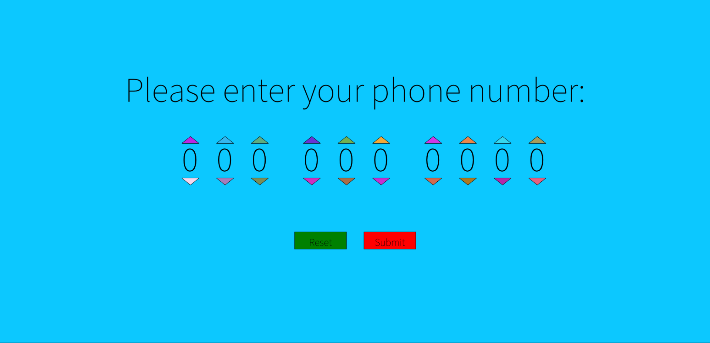
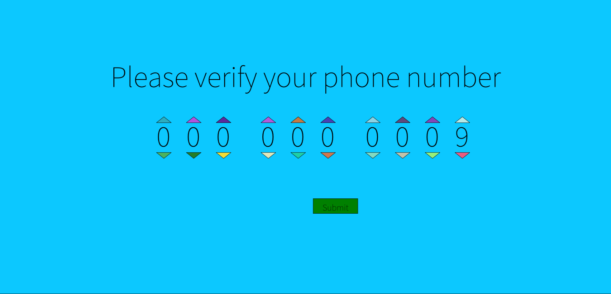
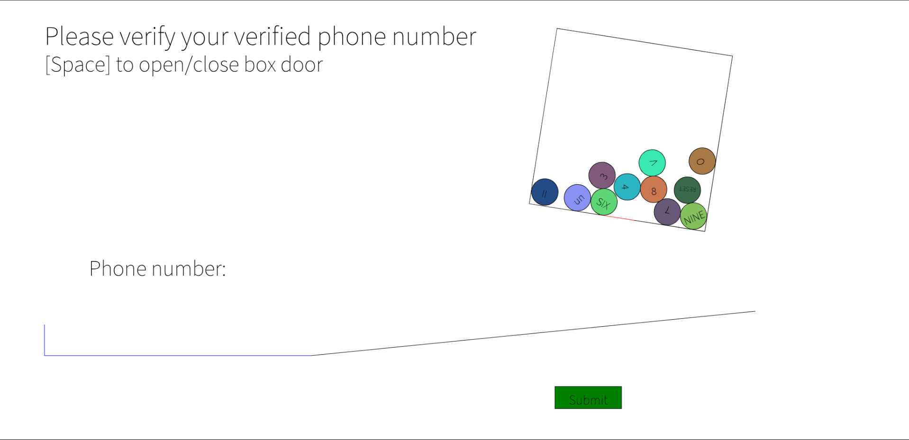
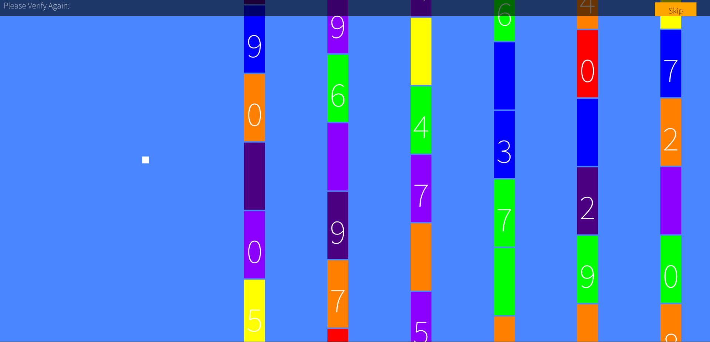
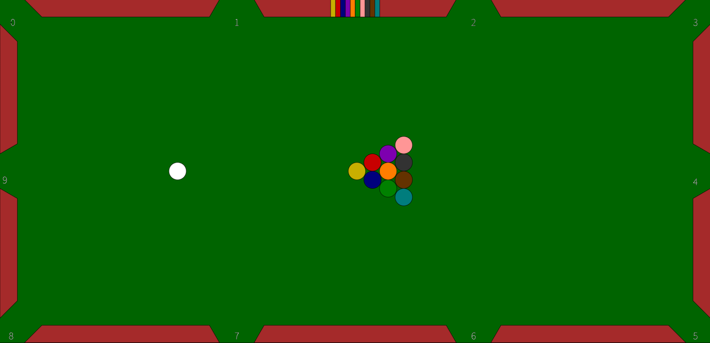

# Phone Number Game

This game has an intentionally bad ui/ux, so its probably best to read this before playing it (or figure it out yourself)

## Stages

To skip any stages, just click the Submit or Skip buttons even if you don't have a full number if you just want to go see the next stage.

### Initial

No tricks, just input your phone number with a slightly inconvenient individual digit increment/decrement system.

### Puzzle

Your previously inputted number gets decreased by 1. When attempting to change it back, you realize that changing one digit adjusts the next one by 2.

Solution from left to right:
U4 U2 D4 D2 U4 U2 D4 D2 U4 U3
Where Ux means up x times and Dx means down x times.

### Bingo

Numbers are put in a box, inconveniently sometimes as roman numerals, in french, etc. You must use your mouse to rotate the box and the space bar to open a hatch which is used to release numbers in order of your phone number. Don't accidentally release the RESET ball, (or do if you messed up or if you want a surprise!).

### Flappy

Click to flap the square, and get your bird through the numbers in order of your phone number. Empty squares are for if you don't get a specific number in the current rotation!

### Pool

Each coloured ball corresponds to a specific position in the phone number as drawn at the top. Each pocket represents a specific number. Combine each right ball with the right pocket to generate your phone number!

## Features

- Random bright colours to make it super hard to look at.
- Inverted colours and positioning on buttons (red submit, green reset)
- No instructions on the game, they are above in the README.
- Useless loading screens
- Stuff is generally very ugly
- The stages get very hard
